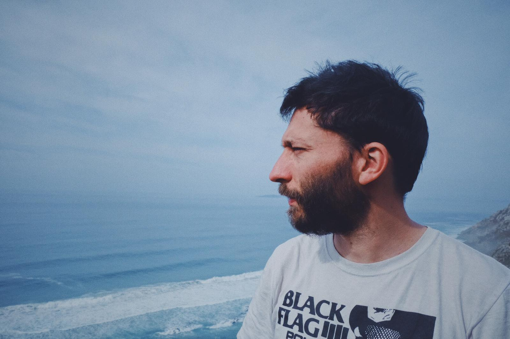

<p align="center">

</p>

## Education

- BSc Oceanography (University of Vigo 2005-2010)

- BSc Biology (University of Santiago de Compostela 2010-2012)

- MSc Microbiology (University Complutense of Madrid 2013-2014)

- PhD Oceanography (Institute of Marine Research - IIM-CSIC, Vigo 2015-2018)


You can find more information in the map. The little points in the ocean are stations of the oceanographic cruises in which I have participated so far: the ["Reykjanes Ridge Experiment" (RREX)](http://www.umr-lops.fr/Projets/Projets-actifs/RREX){target="_blank"} in 2015 and 2017;  the ["BOCATS-OVIDE"](http://bocats.iim.csic.es/en){target="_blank"} in 2016, 2018 and 2021 and the FICARAM cruise in 2019.

```{r echo=FALSE}
#Para los links de las publicaciones: Acúerdate de ponerle el target="_blank" al archivo .html que te genera luego si quieres que no te fusile la puta ventana 
```

```{r, echo=FALSE, error=FALSE, message=FALSE, warning=FALSE}
library(readxl)
library(tidyverse)
library(leaflet)

#Input data
info <- read_excel("web_map_info.xlsx")
RREX15 <- read_excel("C:/Users/MFontela/Nextcloud/Database/RREX15_DATABASE.xlsx")
BOCATS <- read_excel("C:/Users/MFontela/Nextcloud/Database/DataBaseBOCATS_20161019_forMATLAB.xlsx")
RREX17 <- read_excel("C:/Users/MFontela/Nextcloud/RREX/RREX 2017/DATA/ALL/RREX2017ffp.xlsx", 
    sheet = "RREX2017_ODV")
F19<-read_excel("C:/Users/MFontela/Nextcloud/FICARAM/DATA/FICARAM2019_ALL.xlsx")

# Add cruises
RREX15<-RREX15%>%
  distinct((ST),.keep_all = T)%>%
  select(LAT,LON)%>%
  mutate(site="RREX-2015", colour=4, note="Reykjanes Ridge Experiment 2015")%>%
  rename(latitude=LAT, longitude=LON)

BOCATS<-BOCATS%>%
    distinct((Station),.keep_all = T)%>%
  select(Latitude,Longitude)%>%
  mutate(site="BOCATS-2016", colour=5, note="BOCATS/OVIDE 2016 & 2018")%>%
    rename(latitude=Latitude, longitude=Longitude)

RREX17<-RREX17%>%
  distinct((station),.keep_all = T)%>%
  select(latitude,longitude)%>%
  mutate(site="RREX-2017", colour=6, note="Reykjanes Ridge Experiment 2017")

F19<-F19%>%
  distinct((St),.keep_all = T)%>%
  select(Latitude,Longitude)%>%
  mutate(site="FICARAM-2019", colour=7, note="FICARAM-2019")%>%
  rename(latitude=Latitude, longitude=Longitude)

info<-info%>% 
  bind_rows(RREX15)%>% 
  bind_rows(BOCATS)%>% 
  bind_rows(RREX17)%>% 
  bind_rows(F19)

#movida iconos
  estudios<-makeIcon("C:/Users/MFontela/Documents/web/map_icons/university_school-512.png", iconWidth = 68, iconHeight = 75,
  iconAnchorX = 22, iconAnchorY = 94)
  
getColor <- function(info) {
sapply(info$colour, function(colour) {
if(colour >2) {
"red"
} else if(colour > 1) {
"green"
} else {
"blue"
} })
}

icons <- awesomeIcons(
icon = 'university',
iconColor = 'black',
library = 'ion',
markerColor = getColor(info)
)


#saca el mapita
m <- leaflet(info,width = "100%") %>%
addProviderTiles(providers$Esri.WorldImagery)%>%
addAwesomeMarkers(lng=~longitude[info$colour<4], lat=~latitude[info$colour<4], popup=~note[info$colour<4], label=~site[info$colour<4], icon=icons)%>%
  addCircleMarkers(lng=~longitude[info$colour==4], lat=~latitude[info$colour==4], popup=~note[info$colour==4], label=~site[info$colour==4],radius=1,color="blue",labelOptions =labelOptions(noHide = F, direction = 'auto'))%>%
  addCircleMarkers(lng=~longitude[info$colour==5], lat=~latitude[info$colour==5], popup=~note[info$colour==5], label=~site[info$colour==5],radius=1,color="red",labelOptions =labelOptions(noHide = F, direction = 'auto'))%>%
  addCircleMarkers(lng=~longitude[info$colour==6], lat=~latitude[info$colour==6], popup=~note[info$colour==6], label=~site[info$colour==6],radius=1,color="darkcyan",labelOptions =labelOptions(noHide = F, direction = 'auto'))%>%
  addCircleMarkers(lng=~longitude[info$colour==7], lat=~latitude[info$colour==7], popup=~note[info$colour==7], label=~site[info$colour==7],radius=1,color="white",labelOptions =labelOptions(noHide = F, direction = 'auto'))
m  # Print the map

```

