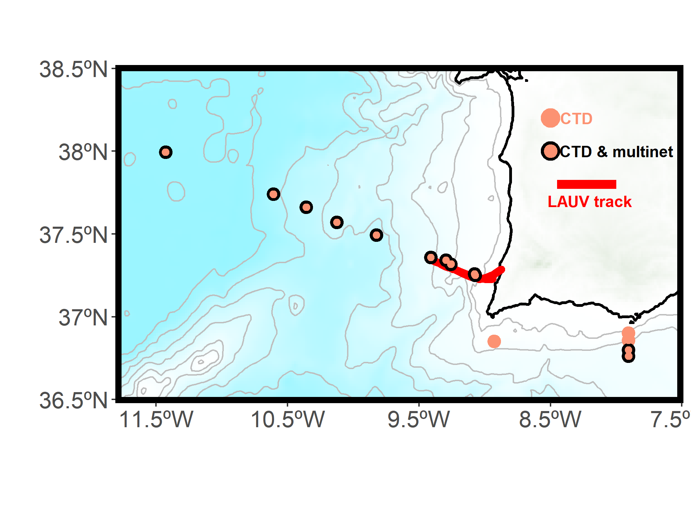

Sharing **FAIR** data (*Findable, Accessible, Interoperable, and Reusable*) fosters collaboration, ensures transparency, and enables reproducibility in scientific research. Reproducibility is especially important in oceanography, where large amounts of data from multiple and diverse sources are generated, and large computational methods are used. By adhering to [FAIR principles](https://force11.org/info/the-fair-data-principles/){target="blank"}, I actively contribute to the open distribution of high-quality datasets. Making research data **openly available** to the scientific community is in alignment with the goals of the public entities that provide funding for my research. The commitment to reproducible science should be at the forefront of good practices in the coming future. 

## SINES-related:

- **Fontela, M.**, Abrantes, F., Álvarez-Fernández, M. J., Borges de Sousa, J., Choi Wang, D., Curbelo, D., Fernández-Román, D., Ferreira, F., Fuentes-Lema, A., Gebara, L., Gomes, M., Herman, T. V., Mega, A., Mendes, R., Molina, G., Muacho, S., Nieto, S., Pereira, H., Pereira, J., Ramalho, S., Relvas, P., Rios-Yunes, D., Serpa, T., Voelker, A. (2022). [Hydrographic dataset from the Eurofleets+ SINES 2022 research cruise in the Iberian Upwelling System](https://doi.org/10.17882/91156){target="_blank"}. SEANOE.

- **Fontela, M.**, Padín, X. A. (2023). [Partial pressure (or fugacity) of carbon dioxide, water temperature, salinity and other variables collected from surface underway observations during the R/V Sarmiento De Gamboa EUROFLEETS+ SINES cruise in the Atlantic Ocean in 2022 (NCEI Accession 0276511)](https://doi.org/10.25921/fxv3-g751){target="_blank"}. NOAA National Centers for Environmental Information.

- **Fontela, M.**, UTM-CSIC (2022). [SINES Cruise, RV Sarmiento de Gamboa](https://doi.org/10.20351/29sg20220911){target="_blank"}. UTM-CSIC.

## GO-SHIP A25 OVIDE-related:

- Lherminier, P., Pérez, F. F., Branellec, P., Mercier, H., Velo, A., Messias, M. J., Castrillejo, M., Reverdin, G., **Fontela, M.**, Baurand, F. (2022). [GO-SHIP A25 - OVIDE 2018 Cruise data](https://doi.org/10.17882/87394){target="_blank"}. SEANOE.

- Pérez, F. F., García-Ibáñez, M. I., **Fontela, M.**, Lherminier, P., Branellec, P., Zunino, P., Alonso Pérez, F., de la Paz, M., Padín, X. A. (2017). [Carbon Dioxide, Hydrographic, and Chemical Data Obtained During the R/V Sarmiento de Gamboa Cruise in the North Atlantic Ocean on CLIVAR Repeat Hydrography Section OVIDE-2016-BOCATS](https://doi.org/10.20350/digitalCSIC/8513){target="_blank"}. Digital.CSIC. http://doi.org/10.20350/DIGITALCSIC/8513

- **Fontela, M.**, Alonso-Pérez, F., Bastero, S., Thierry, V., Pérez, F. F. (2024). [Discrete measurements of pH, dissolved inorganic nutrients (nitrate, phosphate and silicate) and hydrographic variables (salinity, temperature, dissolved oxygen) obtained during the cruise RREX 2015](https://doi.org/10.17882/102883){target="_blank"}. SEANOE.

## Iberian Upwelling System Database: ARIOS  

- Padín, X. A., Doval, M. D., Álvarez-Fernández, M. J., Rey, J., Rellán, T., **Fontela, M.**, Broullón, D., Mohamed-Santamaría, S., Gilcoto, M., Prego, R., Pérez, F. F. (2019). [Arios surveys: Hydrographic and chemical data on SW Galician shelf](https://doi.org/10.20350/digitalCSIC/9963){target="_blank"}. Digital.CSIC. https://doi.org/10.20350/digitalCSIC/9963  

The name *ARIOS* was chosen as a lasting tribute to [Aida Ríos](https://oceanicas.ieo.es/historias-de-pioneras/aida-fernandez/){target="_blank"}, a pioneering woman in the study of ocean acidification.

