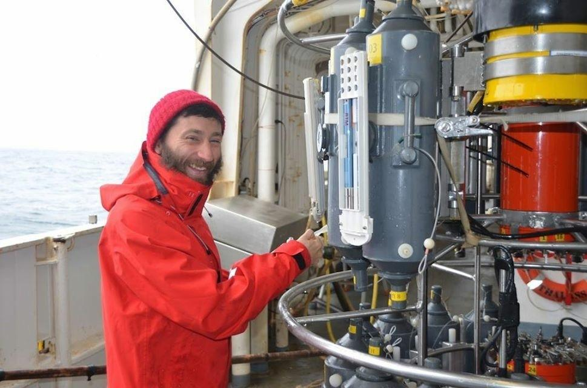

 __Postdoctoral Researcher (ECR)__ 
 
 __[Biological Oceanography Group](http://gobio.webs.uvigo.es/index.php?option=com_content&view=category&layout=blog&id=9&Itemid=233&lang=en){target="_blank"} __, Marine Research Centre (CIM-UVIGO) - __Universidade de Vigo__ 
 
 __[Oceanography and Climate Change](https://ccmar.ualg.pt/group/oceanography-and-climate-change){target="_blank"} __, Centre of Marine Sciences of Algarve - __CCMAR__, Faro. 
 
*It's all about carbon!*

Trying to explain carbon cycle in a changing ocean

