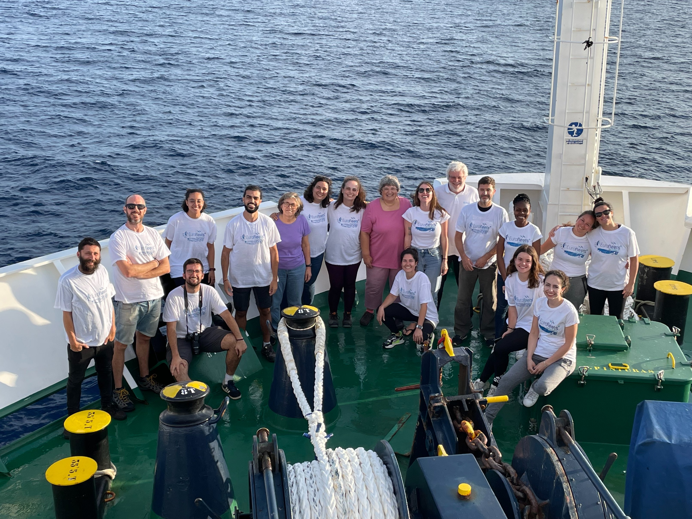

## Mentoring

*(reverse chronological order)*

* **Javier López Fernández** Undergraduate project, BSc Oceanography University of Vigo 2024-2025.  Dissolved Organic Carbon in the coastal-ocean gradient of the SW Iberian Peninsula.

* **María Paz Rendal** Undergraduate project, BSc Oceanography University of Las Palmas de Gran Canaria 2023-2024. Air-sea CO2  exchange in the Algarve shelf is underestimated in current coastal CO2 flux assessments

* **Cleo van Rijs** [IMBRSea Professional Practice](http://www.imbrsea.eu/professional-practice) 2023-2024. Ocean underway observations of Climate-Relevant Biogeochemical variables in the Galician Rías.

* **Nour Bocquet ** [IMBRSea Professional Practice](http://www.imbrsea.eu/professional-practice) 2023-2024. Coupling Global Ocean Dexoygenation and Acidification trough Machine Learning products. 

* **Carlos Nieto Molinos** Undergraduate project, BSc Oceanography University of Vigo 2022-2023.  Abundancia de bacterioplancto asociada a un gradiente costa-océano no Suroeste da Península Ibérica.

* **Sofía Nieto Romero.** Undergraduate project, BSc Oceanography University of Vigo 2022-2023. 
 Magnitud y estructura de tamaños de la clorofila en el gradiente costa-océano del Suroeste de la Península Ibérica en septiembre 2022.

* **Dunia Ríos Yunes.** PhD researcher at NIOZ, Netherlands. [GOA-ON](http://www.goa-on.org/) network [Pier2Peer Program](http://www.goa-on.org/pier2peer/pier2peer.php). [The Ocean Foundation's](https://oceanfdn.org/) International Ocean Acidification Initiative grant. 2022-2023.

* **Verynice Herman Temu**. Laboratory Scientist at the School of Aquatic Sciences and Fisheries Technology of the University of Dar es Salam, Tanzania. NF-POGO-Eurofleets+ Shipboard Training. The Partnership for Observation of the Global Ocean [(POGO)](https://pogo-ocean.org/). 2022

* **[Nils Lucas Jacobsen](https://www.nils-jacobsen.com/)** [IMBRSea Professional Practice](http://www.imbrsea.eu/professional-practice) 2020-2021. [Detecting Trends in Ocean Acidification and Deoxygenation with Open Data](https://www.nils-jacobsen.com/projects/ocean-acidification)

## Teaching materials

* [ECOI_P2](app_alumnos.txt){target="_blank"}, Práctica 2, Ecología I. Muestreo de poblaciones naturales: estimación del tamaño poblacional y de la distribución espacial. Grado en Biología, UVIGO, Octubre 2022.

* [CANAIMOC Workshop](CANAIMOC.html){target="_blank"}, Carbon cycle in the ocean and methods to estimate anthropogenic carbon, IFREMER-Brest, February 2021.

* [eOMP](OMP_simplificado.html){target="_blank"}, Distribución de masas de agua: análisis OMP extendido - Caso práctico, Máster interuniversitario de Oceanografía ULPGC, 2019.

