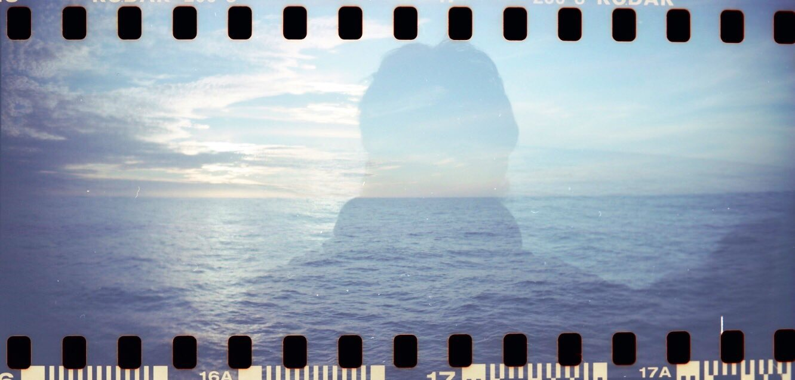

As a scientist deeply committed with **public awareness of science**, I think that a good communication is important to expand the reach of our work into the society. Here I show some of the sites/working groups where I have collaborated.

## Networking

* Member of the working group: [Orienting Young Scientists of EuroMarine "OYSTER"](https://www.euromarinenetwork.eu/OYSTER){target="_blank"}, a
[EUROMARINE](https://www.euromarinenetwork.eu/){target="_blank"} group established to engage and support early career marine scientists. 

* Member of the [North East Atlantic hub of the Global Ocean Acidification Observing Network (GOA-ON)](https://www.pml.ac.uk/Research/Projects/North_East_Atlantic_hub_of_the_Global_Ocean_Acidif){target="_blank"}, of [GOA-ON](http://www.goa-on.org/){target="_blank"}.

* [Climate Feedback Reviewer](https://climatefeedback.org/){target="_blank"}, I belong to a network of scientists that fact-checks media coverage of climate change.

* Member of the [Past Global Changes Early-Career Network (PAGES ECN)](http://pastglobalchanges.org/ecn/intro){target="_blank"} and the Young Earth System Scientists community [YESS](https://www.yess-community.org/){target="_blank"}.

## Seminars

* [North Atlantic Ocean acidification impacts](https://youtu.be/LzdHTnkhzw8?t=2022){target="_blank"}, Ocean Carbon & Biogeochemistry [OCB](https://www.us-ocb.org/) Seminar Series, 2021.

* Atmospheric and Marine Biogeochemistry ([AMB](https://twitter.com/ueaenvamb)) seminar series in the School of Environmental Sciences at the [University of East Anglia](https://www.uea.ac.uk/), October 2020.

## Blog posts

* [Los otros corales](https://superscienceme.wordpress.com/2018/04/05/otros-corales/){target="_blank"}, SuperScienceMe, 2018.

## News 

*(NOTE: they are mostly in Spanish)*

* [Acidificación amenaza supervivencia marina en el Atlántico Sur](https://www.scidev.net/america-latina/news/acidificacion-amenaza-supervivencia-marina-en-el-atlantico-sur/){target="_blank"}, Scidev.Net, 2021.

* [Atlantic ocean circulation system is slowing down, as accurately described in The New York Times article](https://climatefeedback.org/evaluation/atlantic-ocean-circulation-system-is-slowing-down-as-accurately-described-in-the-new-york-times-article/){target="_blank"}, Climate Feedback, 2021.

* [Podcast - Entrevista blog Mar Abaixo](https://marabaixo.gal/podcast-entrevista-marcos-fontela/){target="_blank"}, 2020.

* [Disueltos como aspirinas: así es como la acidificación del océano está acabando con algunos de los seres más antiguos del planeta](https://www.20minutos.es/noticia/4387313/0/cambio-climatico-corales-profundidades-acidificacion-oceano/){target="_blank"}, 20minutos, 2020.

* [Investigadores descubren una nueva amenaza en el Atlántico](https://www.lavozdegalicia.es/noticia/sociedad/2020/09/09/investigadoresdescubren-nueva-amenaza-atlantico/00031599660610531517284.htm){target="_blank"}, La Voz de Galicia, 2020.

* [La mancha del Atlántico: una anomalía que preocupa a los científicos](https://www.lavozdegalicia.es/noticia/sociedad/2019/08/23/mancha-atlantico-anomalia-preocupa-cientificos/00031566555906635538536.htm){target="_blank"}, La Voz de Galicia, 2019.

* [2°C is not known to be a “point of no return”, as Jonathan Franzen claims](https://climatefeedback.org/claimreview/2c-not-known-point-of-no-return-as-jonathan-franzen-claims-new-yorker/){target="_blank"}, Climate Feedback, 2019.

* [Galicia, el futuro refugio del coral](https://www.lavozdegalicia.es/noticia/biodiversa/2018/08/10/galicia-futuro-refugio-coral/0003_201808H10P55991.htm){target="_blank"}, La Voz de Galicia, 2018.

* [Acidification could leave oceans ‘uninhabitable’ for cold-water corals](https://www.carbonbrief.org/acidification-could-leave-oceans-uninhabitable-cold-water-corals){target="_blank"}, Carbon Brief, 2018.

* [Los corales de aguas frías también se están muriendo](https://elpais.com/elpais/2018/02/12/ciencia/1518425669_495853.html){target="_blank"}, El País, 2018.

* [La contaminación acabará con los corales del Atlántico en pocas décadas](https://www.lavozdegalicia.es/noticia/vigo/vigo/2018/02/27/contaminacion-acabara-corales-atlantico-pocas-decadas/0003_201802V27C3991.htm){target="_blank"}, La Voz de Galicia, 2018.

* [Científicos galegos alertan en “Nature” de que os corais de augas frías están en perigo](http://www.gciencia.com/mar/corais-augas-frias-nature/){target="_blank"}, GCiencia, 2018.

* [El cambio climático amenaza las profundidades oceánicas](https://www.elperiodico.com/es/medio-ambiente/20180212/cambio-climatico-profundidades-oceanicas-6619851){target="_blank"}, El Periodico de Catalunya, 2018.

* [La acidificación del Atlántico Norte amenaza a los arrecifes de coral](https://www.farodevigo.es/sociedad/2018/03/03/estudio-participacion-vigues-muestra-acidificacion/1848277.html), Faro de Vigo, 2018.

* [Una tesis viguesa ratifica el papel del Atlántico Norte como destacado sumidero del carbono atmosférico](https://www.farodevigo.es/gran-vigo/2018/05/22/tesis-viguesa-ratifica-papel-atlantico/1896351.html){target="_blank"}, Faro de Vigo, 2018.

* [Unha tese afonda na relación entre as correntes do Atlántico e os sumidoiros de carbono](http://www.gciencia.com/mar/tese-atlantico-carbono/){target="_blank"}, Gciencia, 2018.

## Radio

* [El CO2 y la destrucción de los corales del Atlántico Norte](http://www.canalextremadura.es/alacarta/radio/audios/principio-de-incertidumbre-el-co2-y-la-destruccion-de-los-corales-del){target="_blank"}, Principio de Incertidumbre, Radio Extremadura, 2018.

## Other dissemination activities

* [Virtual Early Career Ocean Professional (V.ECOP) Day](https://vecop.vfairs.com/){target="_blank"}, June 1, 2021. [A live walk through a chemical oceanography survey (GO-SHIP line)](https://www.youtube.com/watch?v=f3XQTaW3CZk){target="_blank"}(Video)

* Invited speaker at [Galicia no Antropoceno: Cambio Climático e outros retos ambientais](http://www.iim.csic.es/index.php/event/galego-ciclo-galicia-no-antropoceno-cambio-climatico-e-outros-retos-ambientais/){target="_blank"} with the conference *Impactos de la acidificación oceánica en Galicia.*, 2018.

* Several activities of scientific divulgation in high schools with interactive experiments: **"Ocean Acidification: the other problem of CO2".**

My willingness is to expand the outreach of the scientific work beyond the academic world, so if you think I can help you, please don't hesitate to contact me! I will do my best, for sure!