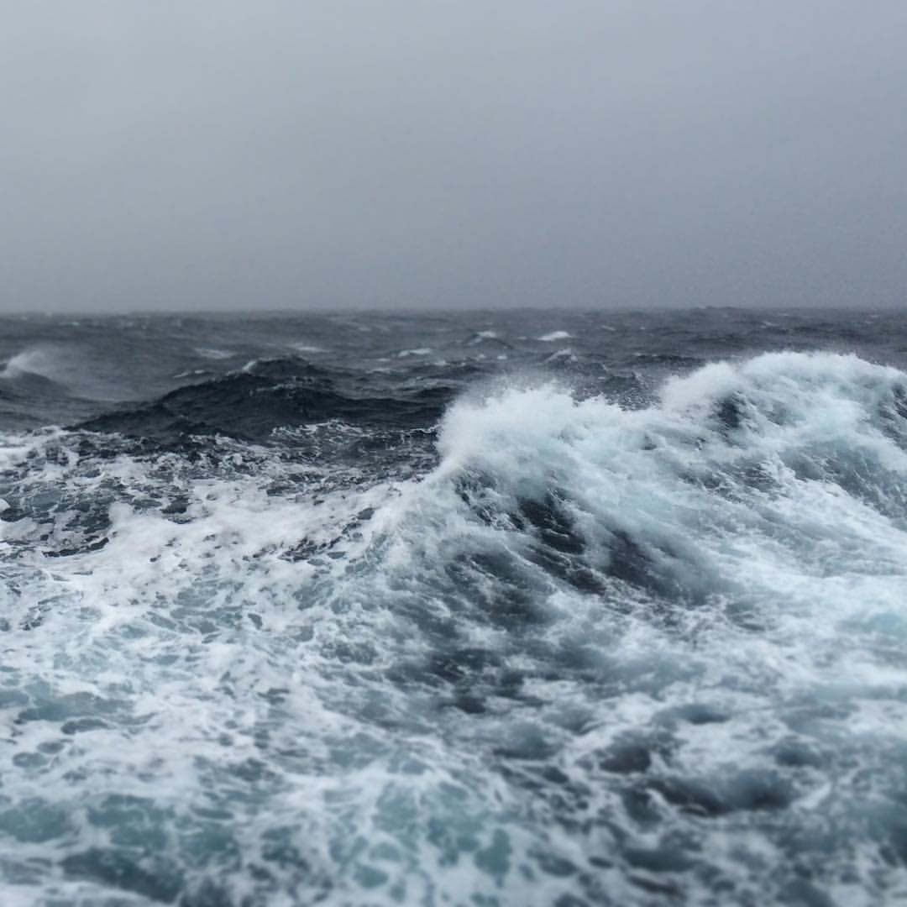
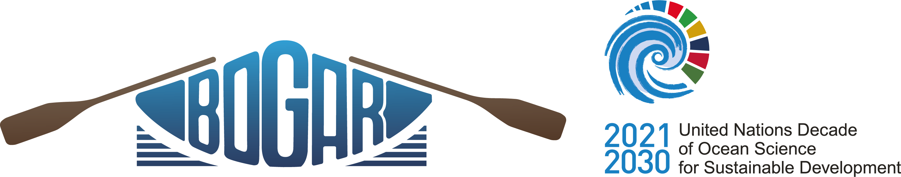
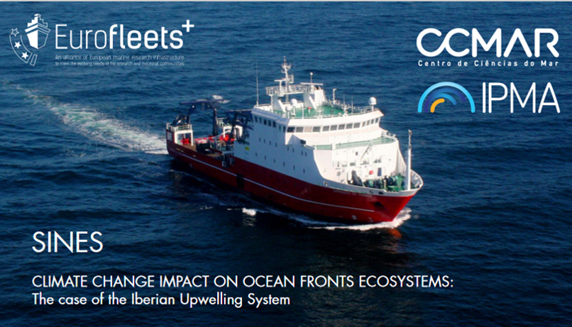

<p align="center">

</p>


*(reverse chronological order)*

-   [**Ocean Alkalinity Enhancement Pelagic Impact Intercomparison Project (OAEPIIP)**](https://appliedbgc.imas.utas.edu.au/ocean-alkalinity-enhancement-pelagic-impact-intercomparison-project/).\
    This project, funded by the Carbon to Sea Initiative and endorsed by SOLAS, represents a globally coordinated effort to investigate the potential effects of ocean alkalinity enhancement on diverse plankton communities. **Spanish Intercomparison experiment leader**: Marcos Fontela.

-   **Observación de variables biogeoquímicas de relevancia climática con buques de oportunidad en la costa gallega y rías (BOGAR)**.\
        **[Project endorsed by the UN Decade of Ocean Science](https://oceandecade.org/actions/ocean-observations-of-surface-waters-in-galicia-bogar/){target="_blank"}**. PTA2022-021307-I.\

    
<p align="center">
  
</p>

-   **Monitoring the ocean carbon cycle from autonomous vehicles: first steps**.\
    IACOBUS program 2022-2023.  Funding agency: European Grouping for Territorial Cooperation Galicia-North Portugal (GNP-AECT).I lead a research project and a 3-month stay in 2023 at the Faculty of Engineering of the University of Porto. There, where I gained hands-on experience with automated observation systems (AUV). \

<p align="center">

</p>

-   **Climate change impact on ocean fronts ecosystems: The case of the Iberian Upwelling System (SINES)**.\
    A proof of concept cruise of **multidisciplinary** research: integrating satellite data to past sediment records within classical methods in oceanography research and automated underwater vehicles to tackle the characterization of the **Iberian Margin Upwelling System**. The overall objective of this study is to identify the changes and risks for marine ecosystem services deriving from the potential impact of climate change on upwelling fronts. This research cruise took place aboard the R/V Sarmiento de Gamboa between 11-20th of September 2022,  was funded by the Eurofleets+ SEA Programme Call “REGIONAL” in 2019/2020 (SEA02_004) and was led by the Centre of Marine Sciences of Algarve (CCMAR, Portugal). Project funded by the European Commission Grant agreement No 824077.\
    **Chief Scientist of th cruise**: Marcos Fontela.

<p align="center">
  
</p>


-   **Global Ocean Acidification Observing Network (GOA-ON) Pier2Peer Program**.\
        Private funds from the Ocean Foundation’s International Ocean Acidification Initiative 2022 Application\

-   **Ocean Training Partnership Nippon Foundation-Partnership for Observation of the Global Ocean (NF-POGO) [Eurofleets+ Shipboard Training](https://www.oceantrainingpartnership.org/SINES2022){target="_blank"}**.\
        Private funds from the Nippon Foundation in partnership with POGO 2022 Application\

```{r echo=FALSE}
#IMP!! Para los links: Acúerdate de ponerle el target="_blank" al archivo .html que te genera luego si quieres que no te fusile la puta ventana. Ponerlo justo después del link, ejemplo <a href="https://www.nature.com/articles/srep26931" target="_blank">
```
