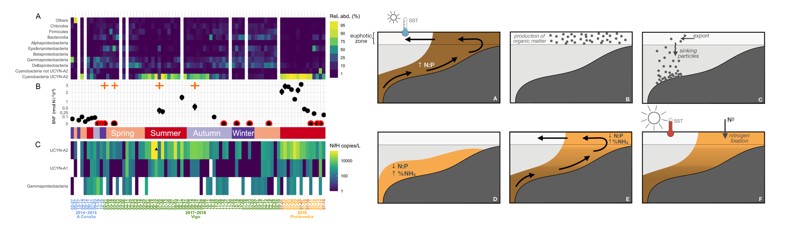
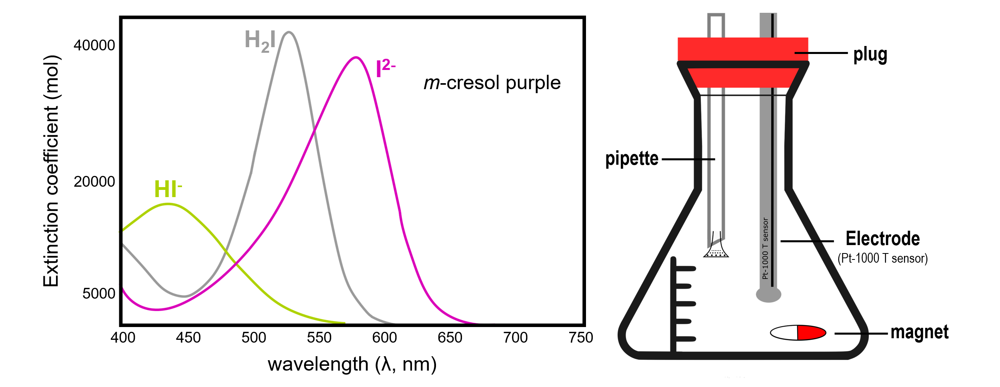
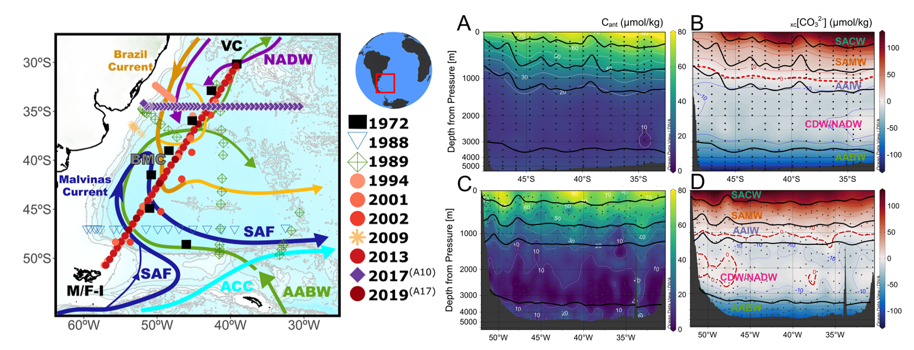
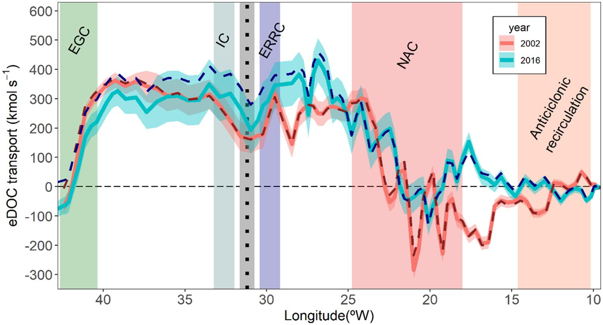
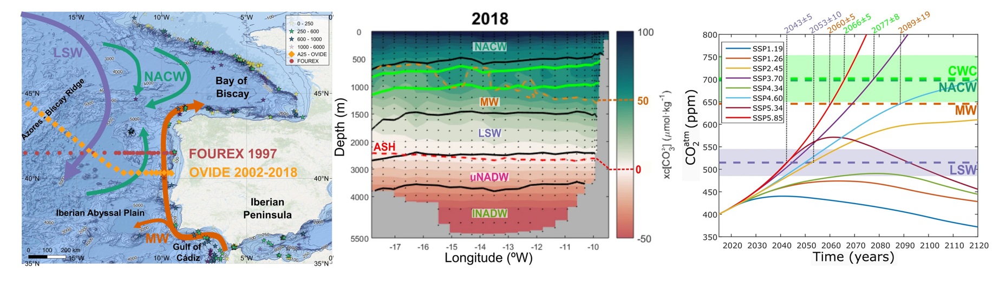
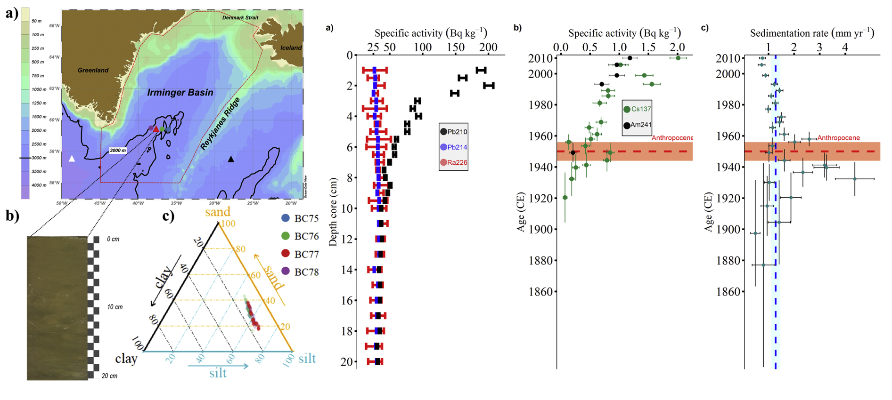
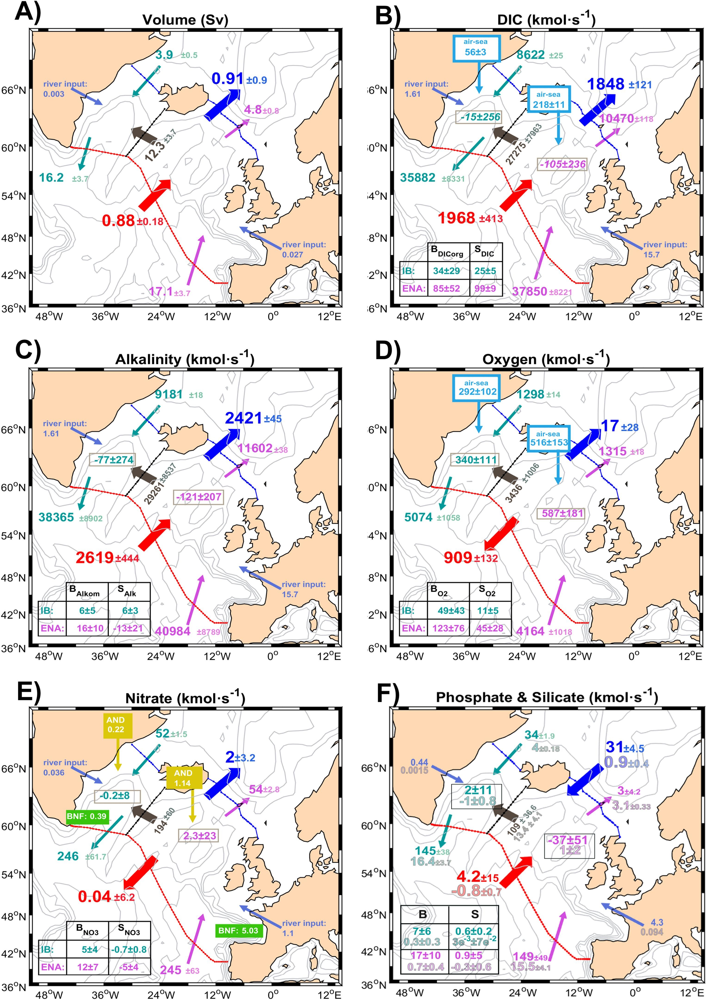
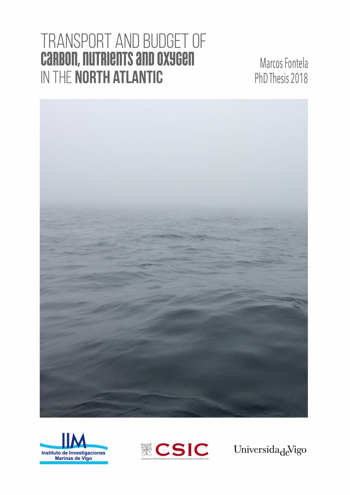
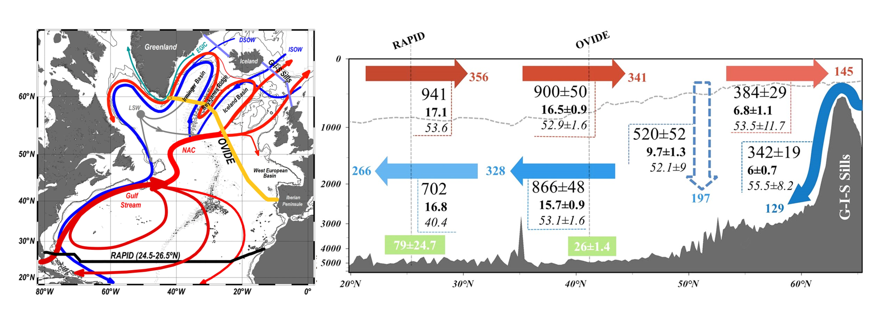

<p align="center">

</p>


*(in progress)*

-   **Fontela, M.** & Padín,X. A. [Interannual air-sea CO~2~ Fluxes in the NW Iberian Upwelling System.](https://digital.csic.es/handle/10261/365001){target="_blank"}

-   **Fontela, M.**, Voelker, A., *SINES crew*, Abrantes, F. [The imprint of anthropogenic climate change in the SW Iberian Upwelling System: a warmer, more acidic and less oxygenated ocean.](https://digital.csic.es/handle/10261/365006){target="_blank"}

*(reverse chronological order, first-author publications are listed along with a related figure.)*

-   O'Callaghan, J., Miloslavich, P., Lorenzoni, L., Satterthwaite, E., Heupel, M., Rome, N., Schloss, I., Elegbede, I., **Fontela, M.** 2025.  [The cross-cutting role of Challenge 7 in achieving a sustainable and resilient global ocean observing system for the next decade.](https://doi.org/10.1093/icesjms/fsaf079){target="_blank"}. ICES Journal of Marine Science, 2025. <https://doi.org/10.1093/icesjms/fsaf079>


-   Graversen, A.E.L., Lønborg, C., ... **Fontela, M.**, ... Krause-Jensen, D. 2025.  [A marine and salt marsh sediment organic carbon database for European regional seas (EURO-CARBON).](https://www.sciencedirect.com/science/article/pii/S2352340925003270){target="_blank"}. Data in Brief
Volume 60, June 2025, 111595. <https://doi.org/10.1016/j.dib.2025.111595>

-   Lubośny, M., Annasawmy, P., Burgués Martínez, I., Turk Dermastia, T., Espasandín, L., Fernandes, J.F., **Fontela, M.**, Galobart, C., Garcia-Garin, O., Gregório, I., Llopis Monferrer, N., López-Acosta, M., Mazurkiewicz, M., Piñeiro-Juncal, N., Schadeberg, A., Scopetani, C., Sowa, A., Suaria, G., Tsiola, A. 2025. [How institutions can better support international early-career researchers](https://www.nature.com/articles/s41562-025-02125-5){target="_blank"}. Nature Human Behaviour 9, 421–423 (2025). <https://doi.org/10.1038/s41562-025-02125-5>

-   Vargas-Yáñez, M., Marcos, M., **Fontela, M.** & Somavilla, R. 2025 - [Physical and biogeochemical changes in the ocean around Spain during the observational period: variability, trends and drivers](http://clivar.es/wp-content/uploads/2025/03/Libro_THE_CLIVAR-SPAIN_REPORT_on_the_climate_in_Spain.pdf){target="_blank"}. Book chapter in the CLIVAR-SPAIN report on the climate in Spain 2025. Ministerior para la Transición Ecológica y el Reto Demográfico (MITECO). ISBN: 978-84-18778-49-0


-   **Fontela, M.**, Fernández-Román, D., Farnelid, H., Fernández-Carrera, A., Marañón, E., Martínez-García, S., Rodríguez-Ramos, T., Varela, M.M., Mouriño-Carballido, B. 2025.  [Puzzling out the ecological niche construction for nitrogen fixers in a coastal upwelling system.](https://academic.oup.com/ismecommun/article/5/1/ycaf018/7998810){target="_blank"}. ISME Communications Volume 5, Issue 1, January 2025. <https://doi.org/10.1093/ismeco/ycaf018>

<p align="center">

</p>


-   Kitch, G. D., Duke, P. J., Grabb, K. C., Simancas-Giraldo, S., Adekunbi, F. O., Addey, C. I., Arbilla, L. A., Carvalho, A. C. O., Chu, S. N., Green, R. A., Hamnca, S., Ghosh, A., Kirkland, A., Lowder, K. B., Meléndez, M., **Fontela, M.**, Robache, K., Ringham, M. C., Rønning, J., Schockman, K. M., Stoll, M. M., Renó de Oliveira, R., Wright-Fairbanks, E. K. 2025. - [Early Career Recommendations for the Equitable Growth of a Marine Carbon Dioxide Removal Sector](https://agupubs.onlinelibrary.wiley.com/doi/10.1029/2024CN000246){target="_blank"}. Perspectives of Earth and Space Scientists, 6(1), e2024CN000246. <https://doi.org/10.1029/2024CN000246>

-   Fernández Castro, B., Fernández Román, D., Ferron, B., **Fontela, M.**, Lherminier, P., Naveira Garabato, A., Pérez, F. F., Spingys, C., Polzin, K., Velo, A. 2024. [Isopycnal eddy stirring dominates thermohaline mixing in the upper subpolar North Atlantic](https://agupubs.onlinelibrary.wiley.com/doi/10.1029/2023JC020817){target="_blank"}. Journal of Geophysical Research: Oceans, 129, e2023JC020817.

-   Mercier, H., Desbruyères, D., Lherminier, P., Velo, A., Carracedo, L., **Fontela, M.**, and Pérez, F. F.: 2024 - [New insights into the eastern subpolar North Atlantic meridional overturning circulation from OVIDE](https://os.copernicus.org/articles/20/779/2024/){target="_blank"}. Ocean Sci., 20, 779–797, <https://doi.org/10.5194/os-20-779-2024>

-   Miloslavich, P., O’Callaghan, J., Heslop, E., McConnell, T., Heupel, M., Satterthwaite, E., Lorenzoni, L., Schloss, I., Belbeoch, M., Rome, N., Widdicombe, S., Olalekan Elegbede, I. & **Fontela, M.** (2024). - [Ocean Decade Vision 2030 White Papers - Challenge 7: Sustainably expand the Global Ocean Observing System](https://unesdoc.unesco.org/ark:/48223/pf0000390124.locale=en){target="_blank"}. Paris, UNESCO-IOC. (The Ocean Decade Series, 51.7.). <https://doi.org/10.25607/brxb-kr45>

-   **Fontela, M.**, Velo, A., Brown,P. J., Pérez, F., 2023 - [Carbonate System Species and pH](https://link.springer.com/chapter/10.1007/978-3-031-14486-8_1){target="_blank"}. Book chapter in Marine Analytical Chemistry Springer Nature Switzerland AG 2023 J. Blasco, A. Tovar-Sánchez (eds.). <DOI:10.1007/978-3-031-14486-8_1>

<p align="center">

</p>

-   Schadeberg, A., Ford, E., Wieczorek, A.M., Gammage, L.C., López-Acosta, M., Buselic, I., Turk Dermastia, T., **Fontela, M.**, Galobart, C., Llopis Monferrer, N., Lubośny, M., Piarulli, S., Suaria, G., 2022. - [Productivity, pressure, and new perspectives: impacts of the COVID-19 pandemic on marine early-career researchers.](https://academic.oup.com/icesjms/advance-article/doi/10.1093/icesjms/fsac167/6748269){target="_blank"}. ICES Journal of Marine Science. <DOI:10.1093/icesjms/fsac167>. Code for reproducibility: **Fontela, M.** & López-Acosta, M. 2022. [Code to reproduce figures in "Productivity, pressure and new perspectives: Impacts of the COVID-19 pandemic on early-career marine researchers"](https://zenodo.org/record/6656133){target="_blank"}. Zenodo.

-   Pérez, F., Olafsson, J., Ólafsdóttir,R., **Fontela, M.** & Takahashi, T., 2021 - [Contrasting drivers and trends of ocean acidification in the subarctic Atlantic](https://www.nature.com/articles/s41598-021-93324-3){target="_blank"}. Scientific Reports, 11, 13991. DOI: 10.1038/s41598-021-93324-3

-   García-Ibañez, M.I., Bates, N., Bakker, D., **Fontela, M.**, Velo, A. 2021 - [Cold-water corals in the Subpolar North Atlantic Ocean exposed to aragonite undersaturation if the 2°C global warming target is not met](https://www.sciencedirect.com/science/article/pii/S0921818121000655){target="_blank"}. Global and Planetary Change. DOI: 10.1016/j.gloplacha.2021.103480

-   **Fontela, M.**, Velo, A., Gilcoto, M., Pérez, F., 2021 - [Anthropogenic CO~2~ and ocean acidification in Argentine Basin Water Masses over almost five decades of observations](https://www.sciencedirect.com/science/article/pii/S0048969721016387){target="_blank"}. Science of The Total Environment. DOI: 10.1016/j.scitotenv.2021.146570. Code for reproducibility: **Fontela, M.** 2021. [mfontela/ArgentineBasin: Tracer trends in Argentine Basin Water Masses (Version v1)](https://zenodo.org/record/4589961){target="_blank"}. Zenodo.

<p align="center">

</p>


-   **Fontela, M.**, Pérez, F., Mercier, H., Lherminier. P., 2020 - [North Atlantic Western Boundary Currents are intense dissolved organic carbon streams](https://www.frontiersin.org/articles/10.3389/fmars.2020.593757){target="_blank"} Frontiers in Marine Science. DOI: 10.3389/fmars.2020.593757


<p align="center">

</p>

-   **Fontela, M.**, Pérez, F., Carracedo, L.I., Padín, X.A., Velo, A., García-Ibañez, M.I., Lherminier. P., 2020 - [The Northeast Atlantic is running out of excess carbonate in the horizon of cold-water corals communities](https://www.nature.com/articles/s41598-020-71793-2){target="_blank"} Scientific Reports 10, 14714 (2020). <DOI:10.1038/s41598-020-71793-2>

<p align="center">

</p>

-   Pedrosa-García, M.C., **Fontela, M.**, Quintana, B., Pérez, F., Marcos, T., 2020 [Precise 210Pb determination with high-efficiency gamma spectrometry for dating of marine sedimentary cores](https://www.sciencedirect.com/science/article/abs/pii/S096980431930541X){target="_blank"} Applied Radiation and Isotopes, DOI: 10.1016/j.apradiso.2019.108962

-   **Fontela, M.**, Francés, G., Quintana, B., Álvarez-Fernández, M. J., Nombela, M. A., Alejo, I., Pedrosa, M. and Pérez, F. F. 2019. [Dating the Anthropocene in deep-sea sediments: how much carbon is buried in the Irminger Basin?](https://www.sciencedirect.com/science/article/pii/S0921818118302169){target="_blank"} Global and Planetary Change, DOI: 10.1016/j.gloplacha.2019.02.008

<p align="center">

</p>

-   **Fontela, M.**, Mercier, H., Pérez F. F., 2019. [Long-term integrated biogeochemical budget driven by circulation in the eastern subpolar North Atlantic.](https://www.sciencedirect.com/science/article/pii/S0079661118302660){target="_blank"}. Progress in Oceanography, DOI: 10.1016/j.pocean.2019.02.004

<p align="center">

</p>

-   Broullón, D., **Fontela, M.**, Padín, X.A., Pérez, F. F., 2018. [Climate change and ocean acidification](http://magazine.educo2cean.org/wp-content/uploads/sites/2/2018/10/CLIMATE-CHANGE-AND-OCEAN-ACIDIFICATION-.pdf){target="_blank"}, EduCO2cean Magazine. 2 - 4, pp. 67 - 88. ISBN 978-84-697-9954-3

-   **Fontela, M.**, 2018. [Transport and budget of carbon, nutrients and oxygen in the North Atlantic](http://digital.csic.es/handle/10261/165428){target="_blank"}. PhD Thesis.

<p align="center">

</p>

-   Pérez, F.F., **Fontela, M.**, García-Ibañez, M.I., Mercier, H., Velo, A., Lherminier, P., Zunino, P., de la Paz, M., Alonso-Pérez, F., Guallart, E. F., Padín X.A., 2018. [Meridional overturning circulation conveys fast acidification to the deep Atlantic Ocean](https://www.nature.com/articles/nature25493){target="_blank"}. Nature, 554, 515--518, DOI: 10.1038/nature25493

-   **Fontela, M.**, García-Ibañez, M.I., Hansell, D.A., Mercier, H., Pérez, F.F., 2016. [Dissolved Organic Carbon in the North Atlantic Meridional Overturning Circulation](https://www.nature.com/articles/srep26931){target="_blank"}. Scientific Reports 6, 26931, DOI: 10.1038/srep26931


<p align="center">

</p>


```{r echo=FALSE}
#IMP!! Para los links: Acúerdate de ponerle el target="_blank" al archivo .html que te genera luego si quieres que no te fusile la puta ventana. Ponerlo justo después del link, ejemplo <a href="https://www.nature.com/articles/srep26931" target="_blank">
```
